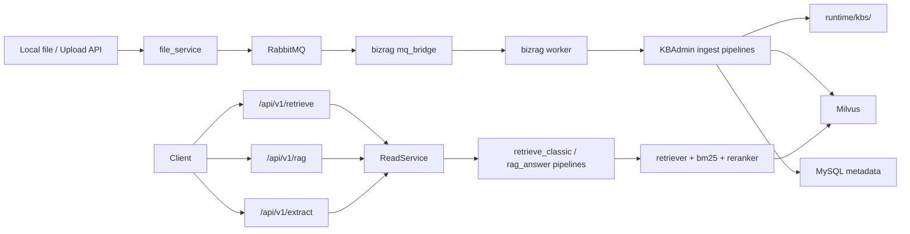

# bizRAG

`bizRAG` 是一个基于 `UltraRAG` 的企业知识库服务项目，当前仓库已经把“写链路、检索链路、RAG 问答、文件监听、事件队列、可观测性”整合到一套可本地运行的 Docker 模板中。

核心能力：

- 文档入库：支持 `pdf/doc/docx/xls/xlsx/txt/md/jsonl` 等常见文件类型
- 文件接入：支持 `file_service` 上传 API，也支持直接监听 `watch` 目录
- 检索：`dense vector + BM25 + merge + reranker`
- 在线接口：`/api/v1/retrieve`、`/api/v1/rag`、`/api/v1/extract`
- 运维接口：KB 管理、事件重放、任务查询、`/ops` 观测面板
- 运行形态：`bizrag` 单容器内同时跑 `API + MQ bridge + worker`

## 系统总览



先分清三个概念：

- `watch` 目录：写链路入口。你拖文件进去，是在触发“入库/更新/删除”
- `read`：对外 HTTP 读接口，对应 `/retrieve`、`/rag`、`/extract`
- `retriever`：内部检索节点，不是主要对外 HTTP API

## 部署 Docker

### 前置条件

- Docker
- Docker Compose
- Linux 服务器或 macOS 开发机

当前 Docker 默认使用：

- embedding 模型：`BAAI/bge-large-zh-v1.5`
- reranker 模型：`BAAI/bge-reranker-large`
- MinerU PDF 解析模型：`pipeline` 套件
- 索引后端：`Milvus`

重要说明：

- 运行期检索仍使用本地模型缓存模式，`sentence_transformers.local_files_only=true`
- `bizrag` 容器启动前会自动补齐 `runtime/` 目录结构，并在缺失时下载默认的 embedding、reranker、MinerU 缓存
- `docker-compose.yml` 里默认 `BIZRAG_HF_OFFLINE=false`，允许新机器首次联网拉模型
- `BIZRAG_READ_WARMUP_KB_IDS` 默认留空，启动时会自动扫描“已有 active 文档”的 KB 来做 warmup
- `HF_CACHE_DIR` 会被挂载到容器内 `/app/.cache/huggingface`，默认是 `./runtime/hf_cache`
- MinerU 的 ModelScope/Hugging Face 缓存也落在这块持久化目录下
- 如果你要做严格离线部署，先准备 `runtime/hf_cache`，然后把 `BIZRAG_HF_OFFLINE=true`

### 最常用启动命令

```bash
cd /Users/haoming.zhang/PyCharmMiscProject/bizRAG

docker compose up -d --build
docker compose ps
```

首次启动说明：

- 新机器第一次启动会下载默认 embedding、reranker、MinerU 模型，耗时会明显长于后续重启
- 启动脚本会自动创建 `runtime/file_service/watch/<FILE_SERVICE_WATCH_DEFAULT_KB_ID>/`
- 所以容器起来后，用户可以直接把文件拖进默认 `watch` 子目录触发写链路

看日志：

```bash
docker compose logs -f bizrag
docker compose logs -f file_service
```

健康检查：

```bash
curl http://127.0.0.1:64501/livez
curl http://127.0.0.1:64501/healthz
curl http://127.0.0.1:8002/api/v1/files/health
```

说明：

- `/livez` 表示 API 进程已经起来，适合做容器存活检查
- `/healthz` 和 `/readyz` 会反映 read service 的 warmup/检索状态

停止和清理：

```bash
docker compose stop
docker compose down
```

仅重建 `bizrag`：

```bash
docker compose up -d --build bizrag
```

仅启动核心服务：

```bash
docker compose up -d mysql rabbitmq milvus file_service bizrag
```

启用 `rustfs` profile：

```bash
docker compose --profile rustfs up -d --build
```

### 关键环境变量

默认配置集中在 [`.env`](./.env)。

最常改的是这些：

| 变量 | 作用 |
| --- | --- |
| `BIZRAG_PORT` | BizRAG HTTP 端口，默认 `64501` |
| `BIZRAG_ACCELERATOR` | `cpu/cuda/auto` |
| `BIZRAG_GPU_IDS` | GPU 模式下指定 GPU |
| `BIZRAG_HF_OFFLINE` | 是否强制离线；默认 `false`，新机器首启可联网拉模型 |
| `BIZRAG_BOOTSTRAP_RUNTIME` | 是否在容器启动前自动初始化 `runtime/` 目录结构 |
| `BIZRAG_BOOTSTRAP_MODELS` | 是否在容器启动前自动补齐默认 embedding/reranker/MinerU 缓存 |
| `BIZRAG_BOOTSTRAP_MINERU_MODEL_TYPE` | MinerU 预下载类型，默认 `pipeline` |
| `HF_CACHE_DIR` | 本地模型缓存挂载目录 |
| `BIZRAG_READ_WARMUP` | 启动时是否预热检索 |
| `BIZRAG_READ_WARMUP_MODE` | `all/first/none` |
| `BIZRAG_READ_WARMUP_KB_IDS` | 可选，逗号分隔；为空时自动发现有 active 文档的 KB |
| `RUSTFS_RABBITMQ_QUEUE` | 事件队列名 |
| `MINERU_MODEL_SOURCE` | MinerU 模型下载源，默认 `modelscope` |
| `FILE_SERVICE_WATCH_DEFAULT_KB_ID` | 启动时自动创建的默认 `watch/<kb_id>` 子目录名 |

如果你要启用 `/api/v1/rag` 的生成能力，还需要在 `.env` 里补一套 OpenAI-compatible 生成配置，例如：

```bash
LLM_MODEL_NAME=deepseek-chat
LLM_API_URL_AGENT=https://your-openai-compatible-endpoint/v1
LLM_API_KEY_AGENT=your_api_key
```

说明：

- `/api/v1/retrieve` 只依赖检索链路
- `/api/v1/rag` 还依赖 generation backend

## Compose 里的服务

入口文件见 [`docker-compose.yml`](./docker-compose.yml) 和 [`docker/start_bizrag.sh`](./docker/start_bizrag.sh)。

| 服务 | 端口 | 作用 | 持久化目录 |
| --- | --- | --- | --- |
| `mysql` | `3306` | BizRAG 元数据存储 | `runtime/mysql` |
| `rabbitmq` | `5672`, `15672` | MQ 队列和管理台 | `runtime/rabbitmq` |
| `etcd` | 内部 | Milvus 依赖 | `runtime/etcd` |
| `minio` | 内部 | Milvus 依赖对象存储 | `runtime/minio` |
| `milvus` | `19530`, `9091` | 向量检索后端 | `runtime/milvus` |
| `bizrag` | `64501` | API + MQ bridge + worker | `runtime`, `logs`, `output`, `raw_knowledge`, `HF cache` |
| `file_service` | `8002` | 文件上传、watch、出站事件 | `runtime/file_service/*` |
| `rustfs` | `9000` | 可选 profile | `runtime/rustfs` |

## 目录结构

仓库里最常用的目录如下：

| 路径 | 作用 |
| --- | --- |
| `bizrag/` | 主业务代码 |
| `bizrag/api/` | FastAPI 路由和依赖注入 |
| `bizrag/service/` | 业务服务层 |
| `bizrag/servers/` | UltraRAG 底层节点，如 retriever/reranker/corpus |
| `bizrag/pipelines/` | 把 servers 串起来的 YAML pipeline |
| `bizrag/entrypoints/` | 进程入口，如 `api_http.py`、`kb_admin_cli.py` |
| `docker/` | `bizrag` 镜像和启动脚本 |
| `file_service/` | 独立文件服务 |
| `runtime/` | 所有运行期持久化数据 |
| `runtime/kbs/` | 每个 KB 的语料、chunk、embedding、索引产物 |
| `runtime/hf_cache/` | embedding/reranker/MinerU 的持久化模型缓存 |
| `runtime/file_service/watch/` | 监听目录，拖文件进这里会触发写链路 |
| `runtime/file_service/storage/` | file_service 保存的版本化文件 |
| `runtime/file_service/state/` | file_service 的 SQLite 元数据库 |
| `raw_knowledge/` | 原始知识文件样本 |
| `rag_eval_workspace/` | 评测数据工作区，不是主部署必需目录 |
| `logs/` | 运行日志 |
| `output/` | 评测和调试输出 |

### `runtime/kbs/<kb_id>/` 典型结构

```text
runtime/kbs/<kb_id>/
  corpus/
    documents/
  chunks/
    documents/
  combined/
    corpus.jsonl
    chunks.jsonl
  index/
    embeddings.npy
    bm25/
    retriever_runtime.yaml
  mineru/
  images/
```

## 对外接口

### BizRAG HTTP API

这些路由主要定义在 [`bizrag/api/routers/read_http.py`](./bizrag/api/routers/read_http.py) 和 [`bizrag/api/routers/kb_admin_http.py`](./bizrag/api/routers/kb_admin_http.py)。

| 方法 | 路径 | 作用 |
| --- | --- | --- |
| `GET` | `/healthz` | 读链路健康检查 |
| `GET` | `/livez` | 进程存活检查 |
| `GET` | `/readyz` | 读链路就绪检查 |
| `POST` | `/api/v1/retrieve` | 检索片段 |
| `POST` | `/api/v1/rag` | 检索后生成答案 |
| `POST` | `/api/v1/extract` | 检索后做结构化抽取 |
| `POST` | `/api/v1/admin/kbs/register` | 注册 KB |
| `GET` | `/api/v1/admin/kbs` | 查看 KB 列表 |
| `POST` | `/api/v1/admin/kbs/ingest` | 手动导入路径 |
| `GET` | `/api/v1/admin/kbs/{kb_id}/documents` | 查看文档状态 |
| `POST` | `/api/v1/admin/kbs/delete-document` | 删除单个文档 |
| `POST` | `/api/v1/admin/kbs/rebuild` | 重建 KB |
| `DELETE` | `/api/v1/admin/kbs/{kb_id}` | 删除 KB |
| `GET` | `/api/v1/admin/tasks` | 查看任务 |
| `POST` | `/api/v1/admin/tasks/{task_id}/retry` | 重试任务 |
| `GET` | `/api/v1/admin/events` | 查看写链路事件 |
| `POST` | `/api/v1/admin/events/{event_id}/replay` | 重放事件 |
| `GET` | `/api/v1/admin/ops/overview` | 概览 |
| `GET` | `/api/v1/admin/ops/health` | 健康快照 |
| `GET` | `/api/v1/admin/ops/spans` | 链路 span |
| `GET` | `/api/v1/admin/ops/files` | 文件与 KB 落盘清单 |
| `GET` | `/api/v1/admin/ops/metrics` | Prometheus 文本指标 |
| `GET` | `/ops` | 浏览器观测面板 |

最小检索请求：

```bash
curl -s -X POST http://127.0.0.1:64501/api/v1/retrieve \
  -H "Content-Type: application/json" \
  -d '{
    "kb_id": "contracts_compose_auto",
    "query": "合同审批怎么走",
    "top_k": 5
  }'
```

### file_service HTTP API

这些路由见 [`file_service/README.md`](./file_service/README.md) 和 `file_service/app/api.py`。

| 方法 | 路径 | 作用 |
| --- | --- | --- |
| `GET` | `/api/v1/files/health` | 健康检查 |
| `POST` | `/api/v1/files/` | 上传新文件 |
| `PUT` | `/api/v1/files/{file_id}/content` | 更新文件内容 |
| `PATCH` | `/api/v1/files/{file_id}` | 修改元数据 |
| `DELETE` | `/api/v1/files/{file_id}` | 删除文件 |
| `GET` | `/api/v1/files/{file_id}` | 查询文件 |
| `GET` | `/api/v1/files/{file_id}/versions` | 查询版本列表 |
| `GET` | `/api/v1/files/{file_id}/content` | 下载文件内容 |

## `read`、`retriever`、`watch` 分别是什么

### `read`

`read` 是对外读服务，核心代码在：

- [`bizrag/api/routers/read_http.py`](./bizrag/api/routers/read_http.py)
- [`bizrag/service/ultrarag/read_service.py`](./bizrag/service/ultrarag/read_service.py)

它对外暴露的是 HTTP 接口：

- `/api/v1/retrieve`
- `/api/v1/rag`
- `/api/v1/extract`

内部调用的 pipeline：

- 检索：[`bizrag/pipelines/retrieve_classic.yaml`](./bizrag/pipelines/retrieve_classic.yaml)
- 问答：[`bizrag/pipelines/rag_answer.yaml`](./bizrag/pipelines/rag_answer.yaml)

### `retriever`

`retriever` 是内部检索节点，不是直接给业务方调用的 HTTP 接口。

定义在：

- [`bizrag/servers/retriever/server.yaml`](./bizrag/servers/retriever/server.yaml)
- [`bizrag/servers/retriever/retriever.py`](./bizrag/servers/retriever/retriever.py)

内部工具接口包括：

- `retriever_init`
- `retriever_search_structured`
- `bm25_search_structured`
- `retriever_index`
- `retriever_delete`
- `retriever_drop_collection`

当前默认读链路是：

1. dense 向量召回
2. sparse BM25 召回
3. merge 融合
4. reranker 重排

默认 Docker 检索参数见 [`bizrag/servers/retriever/parameter.docker.yaml`](./bizrag/servers/retriever/parameter.docker.yaml)。

### `watch`

`watch` 是写链路入口，不是 read。

路径默认是：

```text
runtime/file_service/watch/
```

推荐布局：

```text
runtime/file_service/watch/<kb_id>/...
```

例如：

```bash
mkdir -p runtime/file_service/watch/contracts_compose_auto
cp /path/to/a.docx runtime/file_service/watch/contracts_compose_auto/
```

默认情况下，容器启动时就会自动创建 `runtime/file_service/watch/contracts_compose_auto/`。

这会触发：

1. `file_service` 监听到文件变化
2. 生成 `document.created` 或 `document.updated` 事件
3. 事件发到 `RabbitMQ`
4. `bizrag` 内部 `mq_bridge -> worker` 消费事件
5. 进入 `KBAdmin` 写链路，完成 parse/chunk/index
6. 产物写入 `runtime/kbs/<kb_id>`，索引写入 `Milvus`

如果开启了 auto-register，首次出现 `watch/<kb_id>/` 目录时，系统会尝试自动注册同名 KB。

## 典型操作

### 方案 A：用 `watch` 目录导入文件

```bash
mkdir -p runtime/file_service/watch/contracts_compose_auto
cp /path/to/your.docx runtime/file_service/watch/contracts_compose_auto/
```

查看事件状态：

```bash
curl -s "http://127.0.0.1:64501/api/v1/admin/events?kb_id=contracts_compose_auto&limit=20"
```

查看文档状态：

```bash
curl -s "http://127.0.0.1:64501/api/v1/admin/kbs/contracts_compose_auto/documents"
```

### 方案 B：手动注册 KB 再导入目录

注册 KB：

```bash
curl -s -X POST http://127.0.0.1:64501/api/v1/admin/kbs/register \
  -H "Content-Type: application/json" \
  -d '{
    "kb_id": "demo_kb",
    "source_parameters_path": "/app/bizrag/servers/retriever/parameter.docker.yaml",
    "collection_name": "demo_kb"
  }'
```

导入目录：

```bash
curl -s -X POST http://127.0.0.1:64501/api/v1/admin/kbs/ingest \
  -H "Content-Type: application/json" \
  -d '{
    "kb_id": "demo_kb",
    "path": "/app/raw_knowledge",
    "sync_deletions": true,
    "force": false,
    "prefer_mineru": false
  }'
```

### 方案 C：直接上传到 `file_service`

```bash
curl -s -X POST http://127.0.0.1:8002/api/v1/files/ \
  -F kb_id=demo_kb \
  -F tenant_id=default \
  -F file_name=demo.txt \
  -F "file=@/path/to/demo.txt"
```

### 做一次在线检索

```bash
curl -s -X POST http://127.0.0.1:64501/api/v1/retrieve \
  -H "Content-Type: application/json" \
  -d '{
    "kb_id": "demo_kb",
    "query": "合同审批流程",
    "top_k": 3
  }'
```

如果你已经配置了生成模型，再调用：

```bash
curl -s -X POST http://127.0.0.1:64501/api/v1/rag \
  -H "Content-Type: application/json" \
  -d '{
    "kb_id": "demo_kb",
    "query": "合同审批流程",
    "top_k": 3
  }'
```

## 关键项目文件

| 文件 | 作用 |
| --- | --- |
| `docker-compose.yml` | 整体部署拓扑 |
| `docker/Dockerfile` | `bizrag` 镜像构建 |
| `docker/start_bizrag.sh` | 容器内启动 `API + MQ bridge + worker` |
| `.env` | Docker 环境变量与部署入口配置 |
| `bizrag/entrypoints/api_http.py` | HTTP API 启动入口 |
| `bizrag/api/routers/read_http.py` | `/retrieve /rag /extract` 路由 |
| `bizrag/api/routers/kb_admin_http.py` | KB 管理、任务、事件接口 |
| `bizrag/api/routers/observability_http.py` | `/ops` 和指标接口 |
| `bizrag/service/ultrarag/read_service.py` | 读链路服务封装 |
| `bizrag/service/app/kb_admin.py` | 写链路核心业务对象 |
| `bizrag/service/app/rustfs_events.py` | 事件入队、重放、消费处理 |
| `bizrag/pipelines/retrieve_classic.yaml` | 检索 pipeline |
| `bizrag/pipelines/rag_answer.yaml` | 问答 pipeline |
| `bizrag/servers/retriever/parameter.yaml` | 通用检索参数 |
| `bizrag/servers/retriever/parameter.docker.yaml` | Docker 默认检索参数 |
| `bizrag/servers/reranker/parameter.yaml` | reranker 参数 |
| `bizrag/infra/metadata_store.py` | BizRAG 元数据库 schema 与操作 |
| `file_service/app/db.py` | file_service SQLite schema 与操作 |
| `test/manual_e2e_commands.md` | 常用手工联调命令 |

## 数据表结构

### BizRAG 元数据表

后端实现见 [`bizrag/infra/metadata_store.py`](./bizrag/infra/metadata_store.py)。

支持：

- SQLite：本地文件路径
- MySQL：`mysql+pymysql://...`

#### `knowledge_bases`

```text
kb_id PK
collection_name
display_name
source_root
workspace_dir
source_parameters_path
index_uri
created_at
updated_at
```

作用：记录 KB 注册信息、运行目录、参数模板路径、Milvus collection 路由。

#### `documents`

```text
kb_id + source_uri PK
doc_key
file_name
source_type
content_hash
doc_version
status
corpus_path
chunk_path
last_error
created_at
updated_at
deleted_at
```

作用：记录每个文档在 KB 内的当前状态和产物路径。

#### `tasks`

```text
task_id PK
kb_id
task_type
status
source_uri
payload_json
result_json
error_message
created_at
updated_at
```

作用：记录 `ingest/rebuild/delete/retry` 等后台任务状态。

#### `rustfs_events`

```text
event_id PK
kb_id
event_type
source_uri
status
payload_json
result_json
error_message
worker_id
claimed_at
heartbeat_at
lease_expires_at
attempt_count
created_at
updated_at
```

作用：记录写链路事件、重试、租约和消费状态。

#### `operation_spans`

```text
span_id PK
trace_id
parent_span_id
component
operation
kb_id
task_id
event_id
source_uri
status
details_json
error_message
started_at
ended_at
duration_ms
```

作用：给 `ingest/queue/worker/index/retrieve/extract` 做统一观测。

### file_service SQLite 表

后端实现见 [`file_service/app/db.py`](./file_service/app/db.py)。

#### `files`

```text
file_id PK
tenant_id
kb_id
source_uri UNIQUE
current_version
file_name
content_type
status
created_at
updated_at
deleted_at
```

作用：记录 file_service 侧的当前文件对象。

#### `file_versions`

```text
id PK
file_id
version
storage_key
size_bytes
content_hash
file_name
content_type
created_at
UNIQUE(file_id, version)
```

作用：记录文件每一次版本化落盘。

#### `outbox_events`

```text
event_id PK
file_id
kb_id
event_type
status
payload_json
retry_count
last_error
created_at
updated_at
published_at
```

作用：记录待发送、发送中、发送成功、发送失败的出站事件。

## 模型和检索默认值

当前 Docker 配置的默认值主要来自：

- [`bizrag/servers/retriever/parameter.docker.yaml`](./bizrag/servers/retriever/parameter.docker.yaml)
- [`bizrag/servers/retriever/parameter.yaml`](./bizrag/servers/retriever/parameter.yaml)
- [`bizrag/servers/reranker/parameter.yaml`](./bizrag/servers/reranker/parameter.yaml)

默认值：

- embedding：`BAAI/bge-large-zh-v1.5`
- reranker：`BAAI/bge-reranker-large`
- MinerU：`pipeline` 模型集
- dense `top_k`：`12`
- merge/rerank：由 pipeline 根据请求 `top_k` 和默认检索深度决定
- `sentence_transformers.local_files_only=true`

这意味着当前项目的运行期仍偏向“从本地缓存读模型”，但 Docker 首启会先把默认模型缓存补齐。

## 常见问题

### 为什么拖文件进 `watch` 后没有入库

先查这几项：

- `file_service` 是否健康
- `rabbitmq` 是否健康
- `bizrag` worker 是否在跑
- `GET /api/v1/admin/events` 里事件状态是否是 `success`
- `GET /api/v1/admin/tasks` 里是否有失败任务

### 为什么 `/retrieve` 正常，但 `/rag` 失败

通常是生成模型没配。

`/retrieve` 只要检索链路通就能工作；`/rag` 还要求 generation backend 可用。

### 为什么首次 Docker 启动就报找不到模型

常见原因有两类：

- 首启机器无法访问 Hugging Face / ModelScope
- 你显式把 `BIZRAG_HF_OFFLINE=true`，但本地 cache 还没准备好
- `HF_CACHE_DIR` 指向了不可写目录

处理方式：

- 保持默认配置，确认机器首次部署时可以联网
- 或预先准备 `runtime/hf_cache`
- 如果要严格离线，再把 `BIZRAG_HF_OFFLINE=true`

## 相关文档

- [`bizrag/docs/ProjectStructure.md`](./bizrag/docs/ProjectStructure.md)
- [`bizrag/docs/BizAgentPlatform.md`](./bizrag/docs/BizAgentPlatform.md)
- [`file_service/README.md`](./file_service/README.md)
- [`test/manual_e2e_commands.md`](./test/manual_e2e_commands.md)
