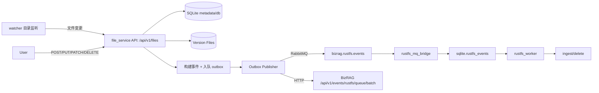

# 文件服务（外部服务）设计说明

## 目标

在 BizRAG 外部提供一个最小但可生产接入的文件入库服务，职责是：

- 接收平台文件上传/更新/删除请求
- 持久化文件版本（本地存储）
- 生成与 BizRAG `RustFSEventRequest` 对齐的事件
- 通过 MQ 或 HTTP Bridge 将事件投递到 BizRAG `mq_bridge -> worker` 链路

目标不包括：

- 文本解析、chunk、向量建索引
- 与 BizRAG 业务对象的耦合式交互（由 BizRAG worker 负责）

## 目录边界

`file_service/` 与 `bizrag/` 平级，明确与核心平台解耦。

- `app/api.py`：HTTP 上传/更新/查询/下载接口
- `app/db.py`：文件元数据与版本元数据（SQLite）以及 outbox 事件表
- `app/storage.py`：本地文件落盘（按 tenant/file_id/version 组织）
- `app/publisher.py`：异步后台任务，消费 outbox 并发送事件
- `app/watcher.py`：监听本地文件夹变更并复用同一入库/出队链路
- `app/events.py`：事件载荷组装逻辑
- `run.py` / `app/main.py`：应用启动、依赖注入与后台任务启动
- `scripts/e2e_http_bridge_smoke.py`：不依赖 MQ 的联调脚本

## 数据流

## 关键约束

- 事件写入优先使用 `download_url`，由 BizRAG worker 拉文件内容。
- `download_url` 需要对 BizRAG Worker 可达（最常见坑：容器内 worker 访问不到宿主机 `127.0.0.1`）。
- 文件服务本身不执行文本解析，避免重复与业务侵入。
- 监听目录中文件通过路径稳定哈希生成 `file_id`，这样重启后对同一路径仍保留同一个 `doc_id`，便于更新与幂等。

## 配置

- `FILE_SERVICE_BASE_URL`：服务自身基础 URL（对外展示）。
- `FILE_SERVICE_DOWNLOAD_BASE_URL`：**事件里 `download_url` 的主机地址**，默认等于 `FILE_SERVICE_BASE_URL`。
- `FILE_SERVICE_PUBLISHER_BACKEND`：`rabbitmq`（默认）或 `http`（联调网关）。
- `FILE_SERVICE_RABBITMQ_URL` / `FILE_SERVICE_RABBITMQ_QUEUE`：事件总线配置。

## 典型联调路径

1. 先启动 BizRAG（API + mq_bridge + worker）与 RabbitMQ。
2. 在 BizRAG 中注册 KB（或已存在）。
3. 启动 file_service，并确保 `FILE_SERVICE_DOWNLOAD_BASE_URL` 指向 BizRAG 可达地址。
4. 调 `POST /api/v1/files`、`PUT /api/v1/files/{file_id}/content`、`DELETE /api/v1/files/{file_id}`。
5. 观察 BizRAG `admin/events?kb_id=...` 由 `queued` -> `sending` -> `success`。
6. 调 BizRAG `/api/v1/retrieve` 与 `/api/v1/rag` 验证入库内容可检索。
